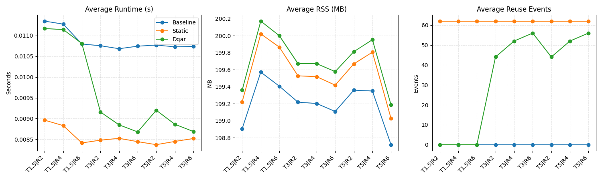

# Dynamic and Quantization-Aware Attention Reuse (DQAR)

DQAR unifies the attention reuse techniques introduced in **DiTFastAttn** (NeurIPS 2024) with the post-training quantization strategies from **PTQ4DiT** to form an adaptive inference controller for Diffusion Transformers (DiTs). The accompanying project proposal (CS494) outlines the desired features:

- Entropy & SNR-based gating that decides when cached attention maps can be reused safely.
- Quantized key/value (KV) caches (INT8 with optional per-channel scaling) that shrink VRAM and memory traffic costs.
- A lightweight policy network that fuses entropy, SNR, latent norms, and diffusion step index into data-driven reuse decisions.
- Layer-aware scheduling so shallow blocks warm up earlier while deeper blocks engage reuse near convergence.

This repository provides a reference implementation of that proposal with an integration harness for DDIM / DPM-Solver style samplers. The code is dependency-light so it can be inspected without GPU packages, yet the APIs are torch-friendly and can be dropped into a Hugging Face DiT or PixArt-Sigma stack once PyTorch is available.

## Repository layout

```
README.md                     – high level description and instructions
pyproject.toml                – project metadata
src/dqar/
    __init__.py               – public API exports
    config.py                 – dataclasses for gate/quantization/policy settings
    stats.py                  – entropy & SNR helpers with torch/python fallbacks
    quantization.py           – CSB-inspired quantizers and Spearman-style calibrator
    cache.py                  – quantized KV cache with temporal & CFG-aware reuse
    policy.py                 – lightweight MLP-style reuse policy with pure-python math
    scheduler.py              – layer scheduling utilities
    controller.py             – glue logic that orchestrates gate decisions & cache IO
examples/minimal_loop.py      – toy sampler loop that shows how to wire up DQAR
examples/run_dummy_dit.py     – dummy diffusion transformer exercising controller hooks
tests/                       – focused unit tests for math-heavy components
```

## Getting started

1. **Install runtime deps** – When you are ready to run on real models, install `torch`, `diffusers`, and `transformers`. The code detects their absence and falls back to pure-python paths so the unit tests here run on a bare Python 3.11 install.
2. **Calibrate quantizers** – Collect ~32 cached attention/KV tensors from your target DiT (conditional + unconditional). Feed them to `SalienceCalibrator` to obtain balancing matrices before activating quantized caching.
3. **Wrap attention blocks** – Replace your DiT attention modules with `DQARController.wrap_attention_block(...)` (or follow the `examples/minimal_loop.py` pattern) so that every block notifies the controller before/after attention.
4. **Tune policy** – Use cached traces (`DQARTraceWriter`) to record entropy, SNR, and quality deltas, then train the `DQARPolicy` using either the built-in python optimizer or by exporting to torch for heavy-duty fitting.

Quick smoke test (no torch required):

```bash
PYTHONPATH=src python examples/run_dummy_dit.py --layers 6 --steps 12
```

## Benchmarking against baseline

Use `scripts/benchmark_dqar.py` to run back-to-back sampling passes (baseline vs. DQAR) and emit both numerical summaries (`benchmark_results.json`) and a bar chart (`benchmark_plot.png`). The script assumes your DiT sampler accepts an optional `controller` keyword and forwards the callbacks into each transformer block; update your pipeline before running the benchmark.

Example (Colab / GPU):

```bash
pip install torch torchvision torchaudio --index-url https://download.pytorch.org/whl/cu121
pip install diffusers transformers accelerate matplotlib
python scripts/benchmark_dqar.py \
  --model facebook/DiT-XL-2-256 \
  --dtype fp16 \
  --steps 30 \
  --guidance 7.5 \
  --conditioning class \
  --class-ids 207,233,472,898 \
  --output-dir outputs/dit-xl
```

Text-conditioned models (PixArt/Sdxl) can keep `--conditioning text` and pass `--prompts`. For class-conditional checkpoints, omit `--class-ids` to let the script pick the first `num-prompts` entries from `id2label`.

To benchmark with a shared prompt set, point the script at any HTTP(S) file containing prompts (newline-delimited `.txt`, array-based `.json`, or `.jsonl` with a `prompt` column):

```bash
python scripts/benchmark_dqar.py \
  --conditioning text \
  --prompt-dataset-url https://huggingface.co/datasets/poloclub/diffusiondb/resolve/main/sample_prompts.jsonl \
  --prompt-dataset-format jsonl \
  --prompt-dataset-field prompt \
  --num-prompts 64
```

The downloaded file is cached under `prompt_datasets/` (override with `--prompt-dataset-cache-dir`), and you can force a refresh via `--prompt-dataset-refresh`.

## Dummy model sweep results

The dummy harness now has a sweep utility that scans entropy thresholds and reuse budgets while recording runtime, RSS, and reuse counts for the baseline, static reuse, and DQAR controllers:

```bash
source .venv/bin/activate  # optional, but needed if you installed matplotlib locally
python scripts/dummy_benchmark_sweep.py \
  --thresholds 1.5,3.0,5.0 \
  --reuse-limits 2,4,6 \
  --dqar-max-gap 6 \
  --runs 5
```

This produces two artifacts at the repo root:

- `dummy_benchmark_sweep.json` – structured trace of every benchmark call.
- `dummy_benchmark_sweep.png` – line plot summarizing runtime, RSS, and reuse trends.



The figure below illustrates that static reuse (gray) consistently hits the maximum number of reuse events but also maintains a slightly higher RSS. DQAR (blue) approaches that reuse rate only when both the entropy threshold and reuse budget increase, at the expense of marginally higher runtime. Baseline (orange) serves as a sanity check and remains flat across the grid.

Outputs per run:

- `benchmark_outputs/baseline/` and `benchmark_outputs/dqar/` image dumps (optional).
- `benchmark_results.json` – avg runtime, stddev, and peak VRAM for both runs.
- `benchmark_plot.png` – quick visual comparison.

## References

- CS494 Project Proposal – Dynamic and Quantization-Aware Attention Reuse (Gautham Satyanarayana, 2025)
- NeurIPS 2024: *DiTFastAttn – Attention Compression for Diffusion Transformer Models*
- arXiv 2405.16005v3: *PTQ4DiT – Post-training Quantization for Diffusion Transformers*

These PDFs live at the repo root for convenience and were the only sources consulted while writing this scaffolding.
